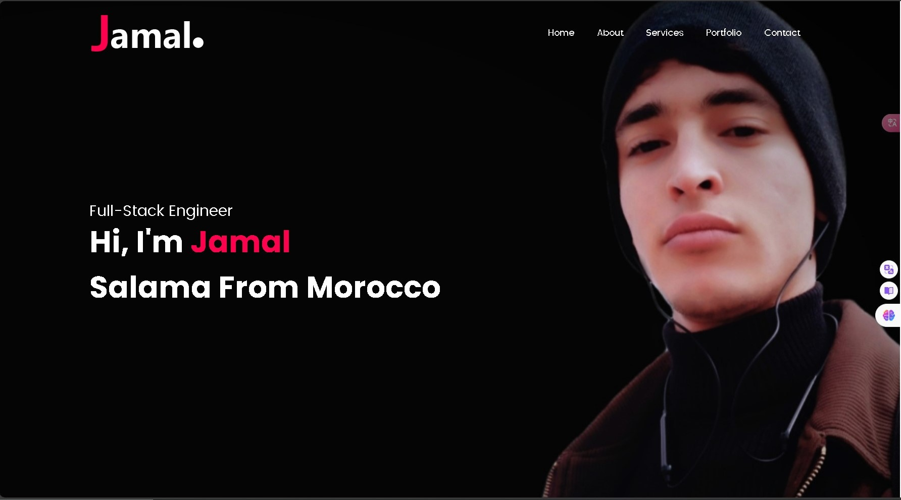
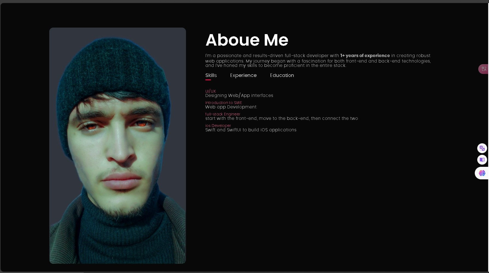
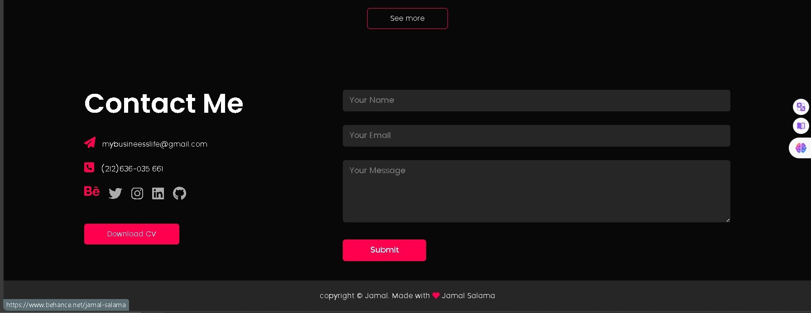

alx_capstone_project 
Project Overview: 
The alx_capstone_project is an exciting endeavor aimed at solving a specific problem or providing value to users. This project aims to [This exciting endeavor aims to solve a specific problem or provide value to users. Whether it’s streamlining a process, enhancing user experience, or addressing a common pain point, this project has a clear purpose. By showcasing it in your portfolio, you’ll demonstrate your skills and commitment to real-world problem-solving]. Whether it’s streamlining a process, enhancing user experience, or addressing a common pain point, this project has a clear purpose.
 
Features and Functionality: 
Unique Identifier
Your value proposition serves as a unique identifier for your business. It encapsulates what makes your offerings distinct and compelling. Without a well-defined value proposition, potential buyers lack a clear reason to choose your products or services over those of competitors. It is the beacon that guides their decision-making process.

Not Interchangeable with Other Brand Assets
It’s crucial to differentiate your value proposition from other brand elements such as mission statements, slogans, or taglines. While these serve different purposes, your value proposition specifically addresses why your product or service stands out. It goes beyond mere catchphrases and dives into the core reasons why you’re the best choice in the market.

Customer-Centric Approach
A great value proposition is customer-centric. It speaks directly to the challenges your customers face. By positioning your company as the problem-solver, you demonstrate empathy and understanding. Highlight what sets you apart from competitors, but also emphasize how customers perceive your value. It’s not just about features; it’s about meeting their needs and aspirations.

1-Professional Presentation: A portfolio allows you to present your work in a professional and visually appealing manner. Whether you’re a designer, developer, writer, or any other professional, a well-structured portfolio can leave a lasting impression on potential clients, employers, or collaborators. 
2-Showcase Your Expertise: Users can demonstrate their expertise by including a variety of content in their portfolio. This might include:
Projects: Highlight completed projects, case studies, or personal initiatives. Describe the problem, your solution, and the impact.
Skills: List your technical skills, soft skills, and any certifications you’ve earned.
Work Experience: Share details about your professional journey, including roles, responsibilities, and achievements.
Education: Mention your educational background, degrees, and relevant coursework.
Testimonials: Include recommendations or testimonials from clients, colleagues, or supervisors. 
3-Networking and Collaboration: A portfolio serves as a bridge for networking and collaboration. Users can share their portfolio with potential clients, collaborators, or employers. It’s an opportunity to connect with like-minded individuals and explore new opportunities. 
4-Job Search and Freelancing: For job seekers, a portfolio is essential. Employers often look for candidates with a strong online presence. Freelancers can use their portfolio to attract clients and showcase their capabilities. 
5-Personal Branding: Your portfolio is an extension of your personal brand. It reflects your style, values, and unique approach to your work. Users can use their portfolio to establish credibility and differentiate themselves in a competitive market. 
6-Learning and Growth: Building a portfolio encourages self-reflection. Users can assess their progress, identify areas for improvement, and set goals for their professional development.
 
Technologies Used: 
The alx_capstone_project leverages the following technologies, frameworks, and languages: 

HTML 
CSS 
JavaScript 
 
Screenshots or Demo: 

Roadmap and Future Enhancements: 
While the current version of the project is impressive, there’s always room for growth. Here are some future plans and potential improvements:
 
Feature Expansion: Project Showcase / Client Testimonials / Interactive Elements / Skills Matrix / Blog or Articles / Responsive Design...
Performance Optimization: Image Compression / Minification / Caching / Lazy Loading / Profiling and Monitoring / ...
 
Contact Information: 
Name: Jamal Salama 
Email: mybusineesslife@gmail.com 
LinkedIn: https://www.linkedin.com/in/jamal-salama-465521298/ 
Behance: https://www.behance.net/jamal-salama
